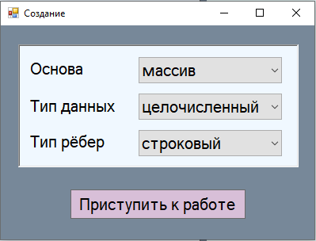
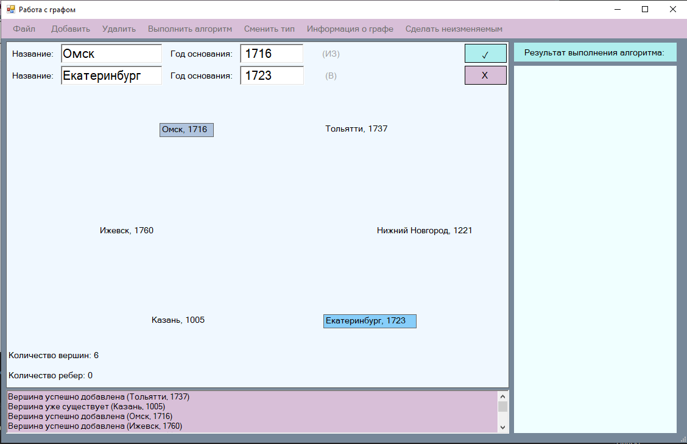
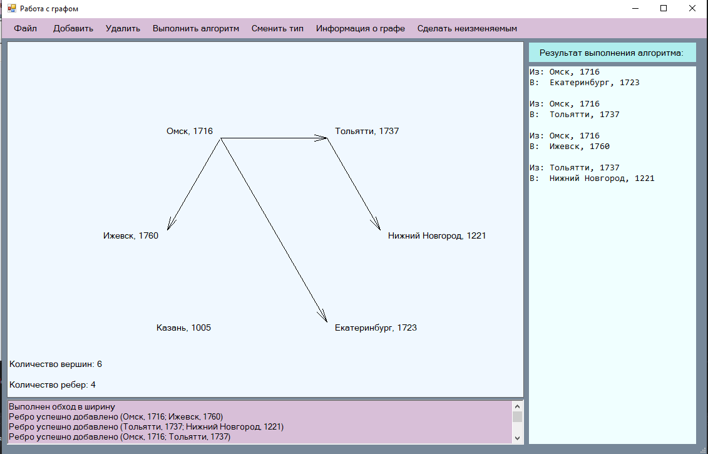
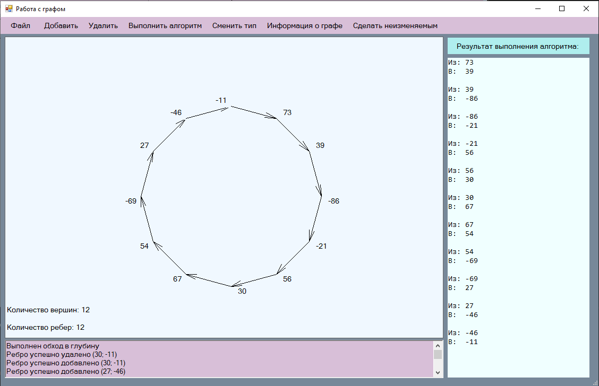

# Graph-Library-2nd-Year
Библиотека для работы с ориентированными графами + GUI-приложение с демонстрацией работы.

## Изначальная задача
Разработать обобщенный класс Graph<N, L> – класс для описания ориентированных графов (N – тип вершин; L – тип связей).  
Класс должен поддерживать базовые алгоритмы на графах.
Также необходимо разработать GUI-приложение, демонстрирующих основные аспекты работы с данной библиотекой ориентированных графов.

## Реализация библиотеки
1. Разработан интерфейс ориентированного графа (IGraph).
2. Создана реализация на основе массива (ArrayGraph).
3. Создана реализация на основе списка (LinkedGraph).
4. Разработан класс с исключениями (GraphException).
5. Разработан класс, содержащий основные алгоритмы для работы с графами (обходы в глубину и ширину, проверка на ацикличность), а также методы Exists, CheckForAll, ForEach и др. (GraphUtils)

## Реализация GUI-приложения
1. В начале работы пользователю предлагается выбрать следующие параметры:  
  — основа графа (массив, список);  
  — тип вершин (целочисленный, город)  
  — тип рёбер (целочисленный, строковый или отсутствие весов).  
2. Просмотр установленных параметров можно произвести, нажав на кнопку "Информация о графе".
3. Количество вершин и ребер в графе отображается в нижнем левом углу приложения.
4. Добавлена возможность сохранять граф в файл и считывать его из файла. 
5. Добавление вершины в граф. "Добавить" -> "вершину".  
Пользователю предоставляется возможность как самостоятельньно ввести значение в появившиеся текстовые поля, 
так и сгенерировать его случайным образом. В случае типа вершин "город" выбирается случайное значение из подготовленного массива с корректными значениями. 
Не допускается создание вершин с одинаковыми значениями.
6. Удаление вершины из графа. "Удалить" -> "вершину".  
Допускается удаления вершины путем ввода ее значения в текстовые поля, а также путем щелчка на нее. После щелчка на вершину ее значение автоматически заносится в текстовые поля.
7. Добавление ребра в граф. "Добавить" -> "ребро".  
Добавление ребра в граф осуществляется двумя способами: ввод данных о вершинах, которые необходимо соединить ребрами, или же нажатие на эти 2 вершины. Отсутствует возможность добавлять кратные ребра.
8. Удаление ребра из графа. "Удалить" -> "ребро".  
Способы удаления ребра аналогичны способам его добавления.
9. Кнопка "Сделать неизменяемым". Нажатие данной кнопки блокирует кнопки "Добавить" и "Удалить", а также меняет надпись на кнопке на "Сделать изменяемым".
10. Текстовые поля, в которые должны быть введены числа, ограничены только на ввод символов цифр и знакак минуса (если он идет первым).
11. Все совершенные действия, а также сообщения о невозможности действий отоюражаются в логе.

## Примеры работы GUI-приложения
Начало работы:  

Добавление ребра между вершинами:

Обход графа в ширину из вершины "Омск, 1716":

Обход графа в глубину из вершины "73":

